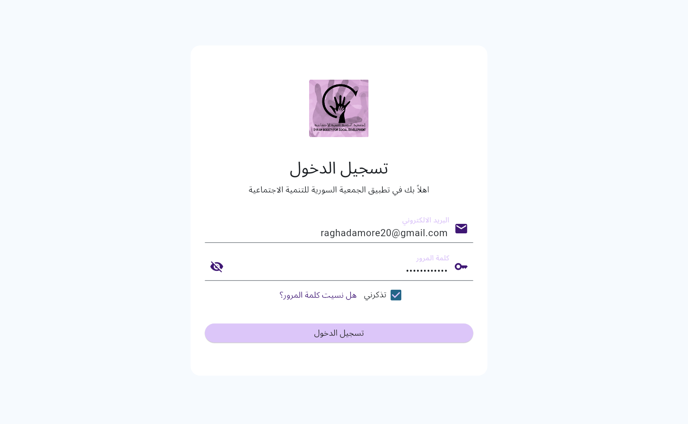
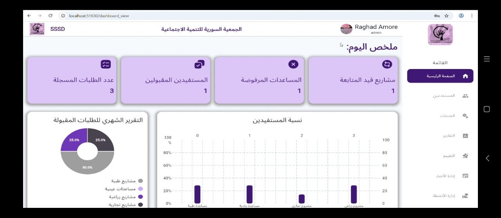
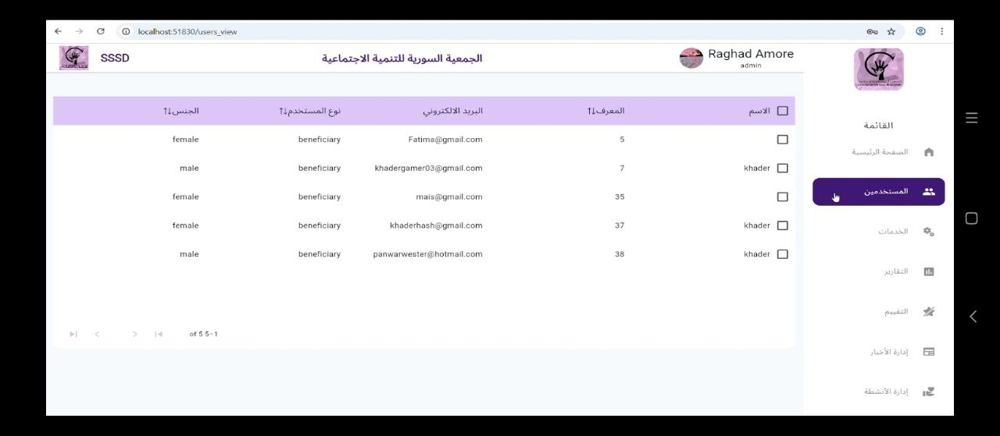
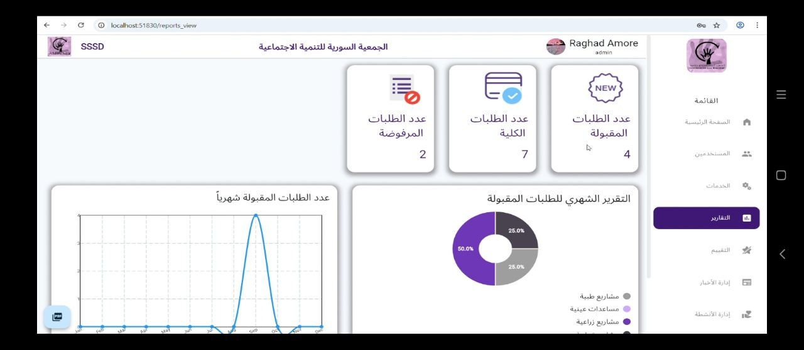
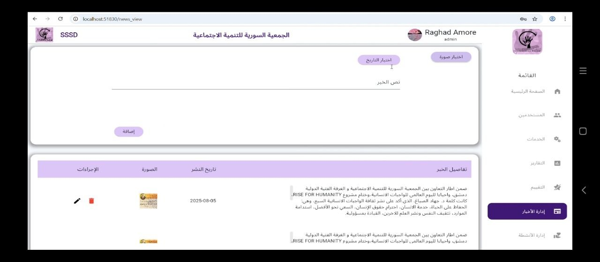
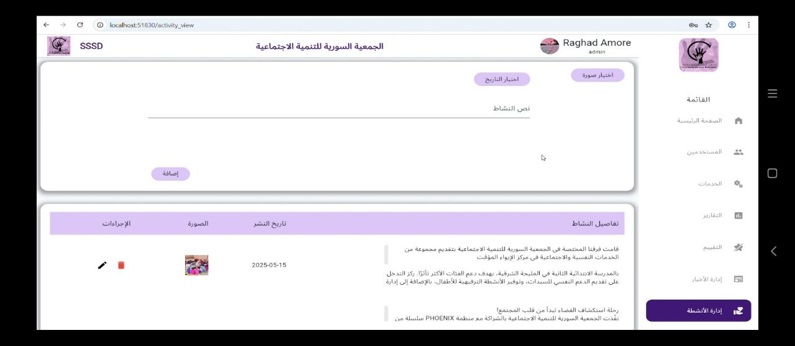
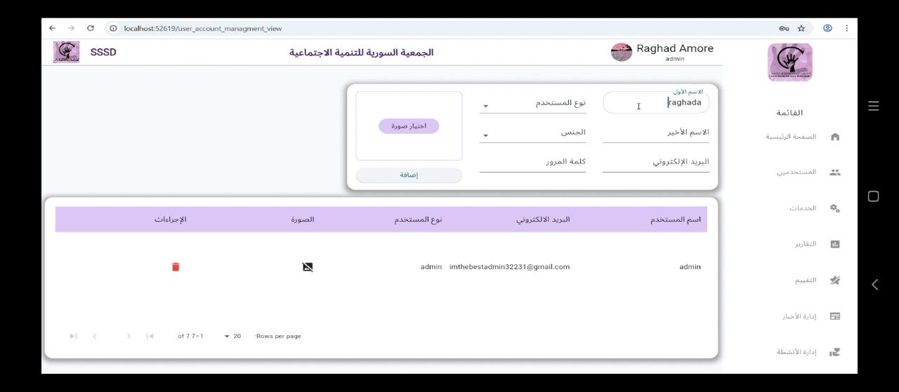

# NGO Management Dashboard - Flutter Web

## 📊 Overview
A full-featured web dashboard built using Flutter Web to automate and manage the operations of an NGO.  
The system provides a centralized platform to manage users, services, activities, news, evaluations, and reports using real-time API data.

---

## 🔐 Authentication System
- Login using email & password
- Email verification
- Password reset functionality

---

## 🏠 Dashboard Overview
- Summary of daily statistics
- Accepted, rejected, and pending requests
- Ongoing projects tracking
- Data visualization using charts

---

## 🛠 Services Management
- Manage different types of services:
  - Medical Aid
  - Financial Aid
  - Small Business Projects
  - In-kind Support
- Filter requests by service type
- View request status (approved, rejected, pending)
- Organized data tables

---

## 👥 Users Management
- View and manage users
- Role-based access (Admin / Beneficiary)

### Admin Capabilities:
- Add new users
- Edit user data
- Delete users
- Access advanced features

---

## 🔐 Role-Based Access Control (RBAC)
The system implements role-based access control:

- Admin users have full access to management features
- Restricted access for regular users
- Secure handling of sensitive operations

---

## 📊 Reports & Analytics
- Monthly reports visualization
- Charts (Pie & Line)
- Data insights for decision-making

### 📄 PDF Export Feature
- Generate reports as PDF with one click
- Ready for sharing and printing
- Simulates real business reporting systems

---

## ⭐ Evaluation System
- Collect user feedback
- Display satisfaction statistics
- Visual charts for analysis

---

## 📰 News Management
- Add and manage news
- Upload images
- Track publishing dates

---

## 📋 Activities Management
- Add and manage activities
- Upload images
- Track events over time

---

## 🛠 Tech Stack
- Flutter Web
- REST API Integration
- GetX (State Management)
- MVVM Architecture

---

## 🧠 Key Highlights
- Built a complete multi-module dashboard system
- Integrated real API for dynamic data handling
- Implemented authentication system
- Applied role-based access control (RBAC)
- Managed complex data tables with filtering
- Implemented PDF report generation
- Designed scalable architecture (MVVM)

---

## 🎯 Purpose
This project simulates a real-world NGO management system and demonstrates the ability to build scalable and production-ready Flutter web applications.

---

## 📸 Screenshots

<>
<!--  -->
<!--  -->
<!--  -->
<!--  -->
<!--  -->
<!--  -->
<!--  -->
<!--  -->
## 🔗 Repository
[https://github.com/raghadamore/flutter_dashboard/]
